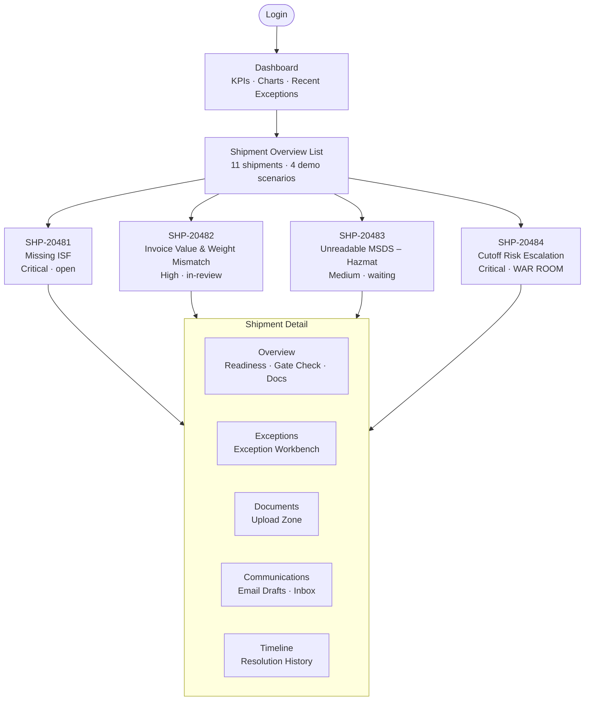
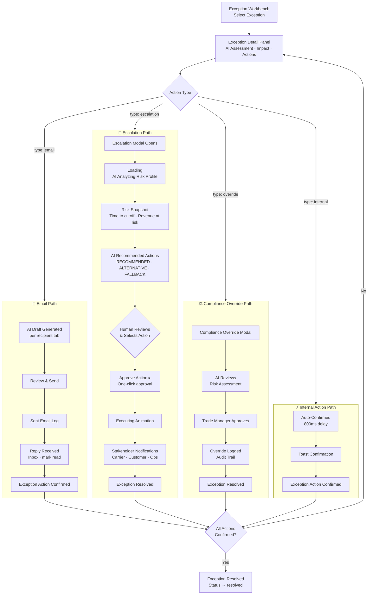
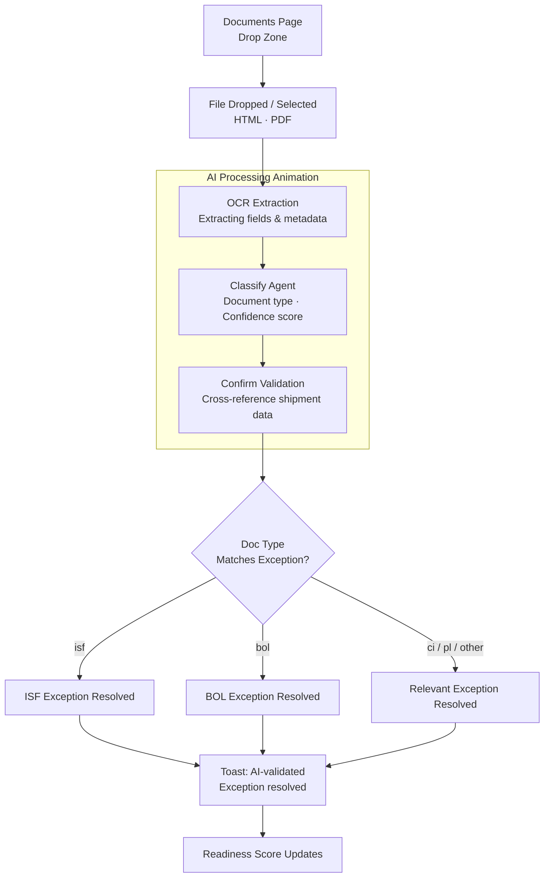
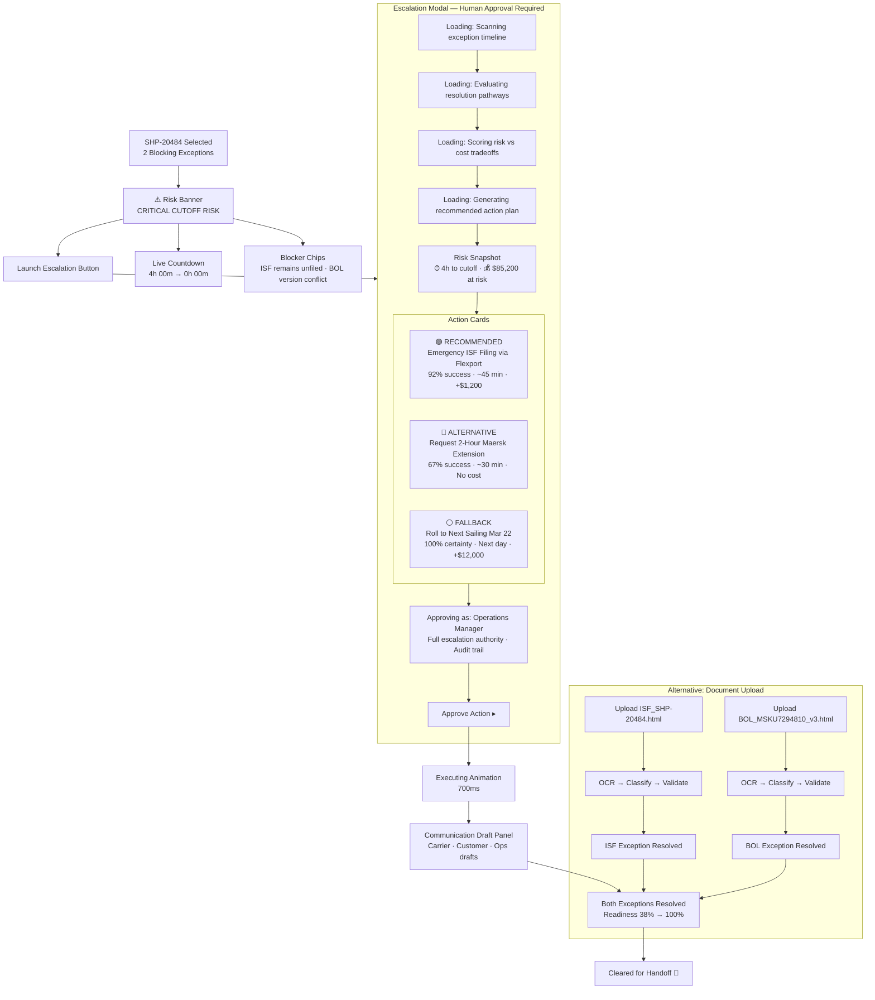
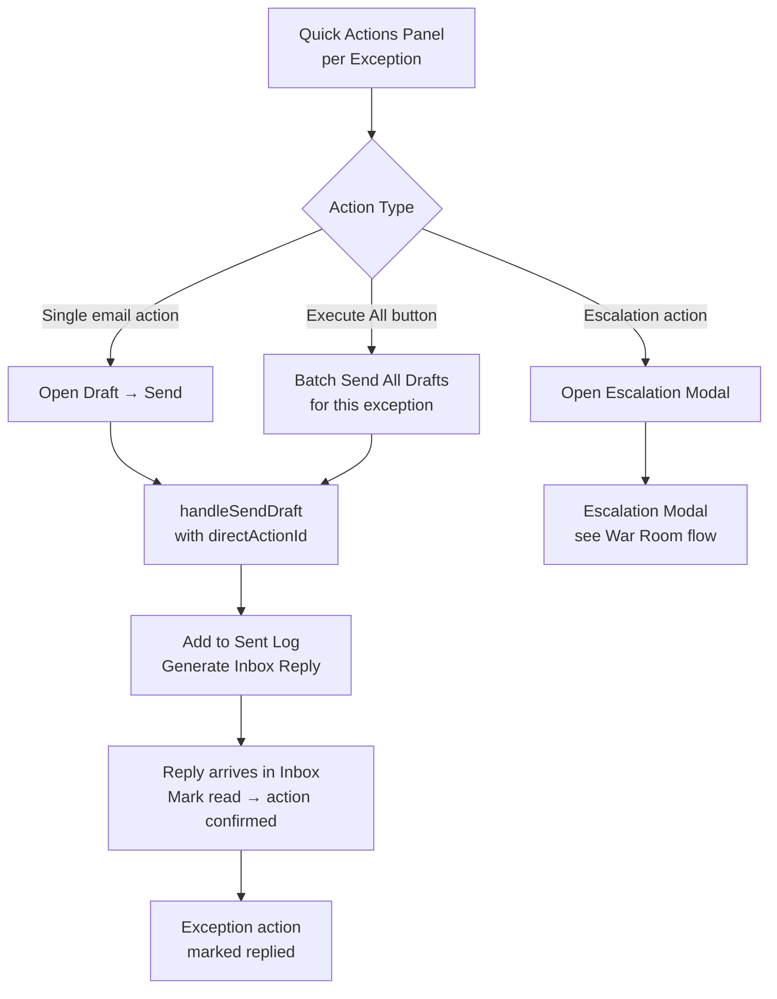

# Application Flow — Operations Readiness Manager

This document maps the complete interaction flow of the demo, from login through all resolution paths to handoff completion.

---

## 1. Top-Level Navigation Flow

---

## 2. Exception Resolution — Three Paths

---

## 3. Document Upload Resolution Path

---

## 4. War Room — SHP-20484 Specific Flow

---

## 5. Happy Path — All Exceptions Cleared

```mermaid
flowchart LR
    R0[Readiness 0–37%\nMultiple blockers] -->|Exceptions resolve one by one| R1
    R1[Readiness 38–69%\nPartial resolution] -->|Final exception cleared| R2
    R2[Readiness 100%\nAll exceptions resolved]

    R2 --> HP[Happy Path Triggered\nauto-pivot to Overview]

    subgraph HP[Cleared for Handoff Screen]
        direction TB
        H1[✅ Green pulsing animation]
        H2[Shipment ID · Lane · Vessel]
        H3[All documents validated]
        H4[Gate Check: All stages complete]
        H5[Ready for customs handoff]
    end

    HP --> GC[Gate Check Complete\nDocs Received ✓ · Validated ✓\nCompliance ✓ · Handoff Ready ✓]
```

---

## 6. Quick Actions Flow

